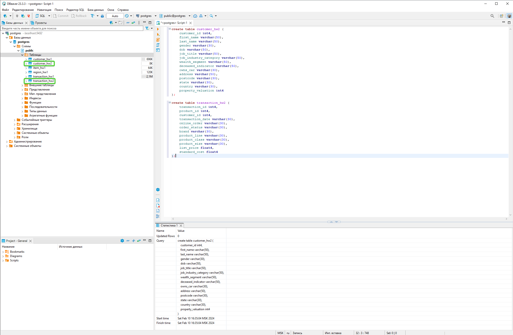
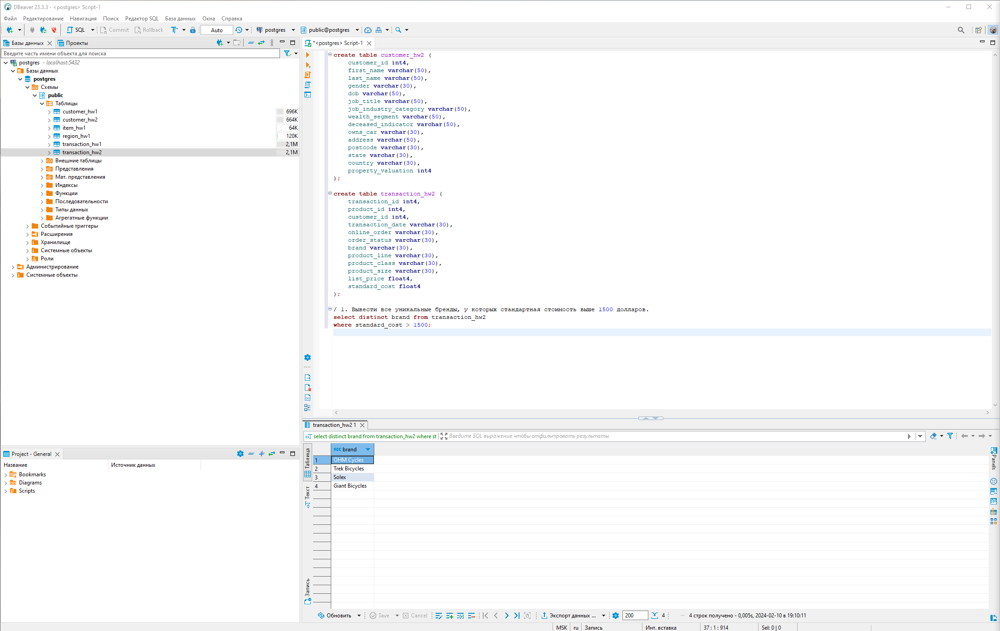
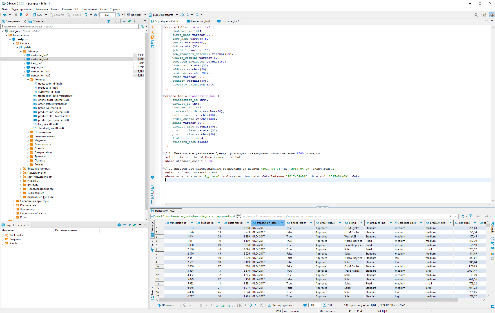
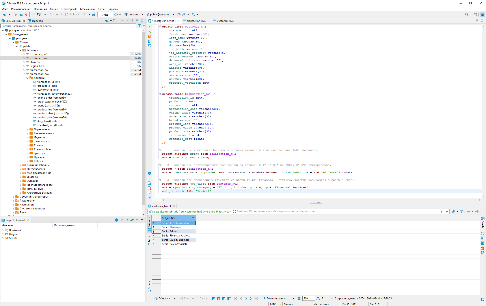
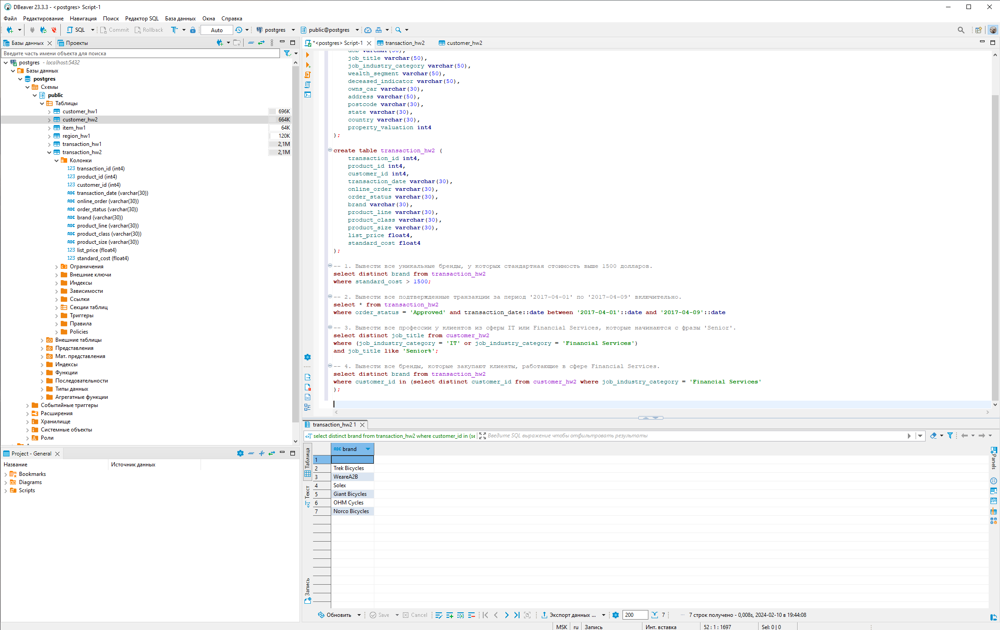
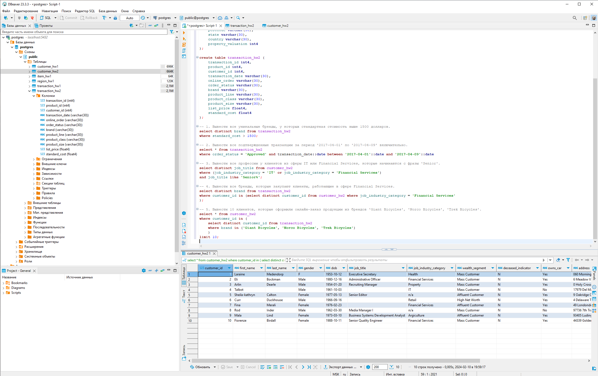
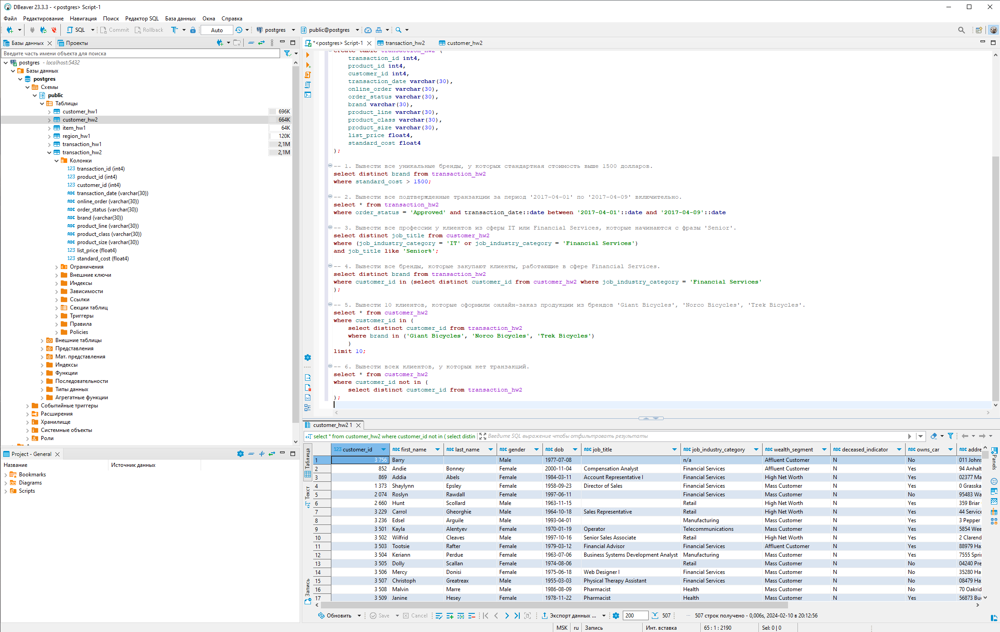
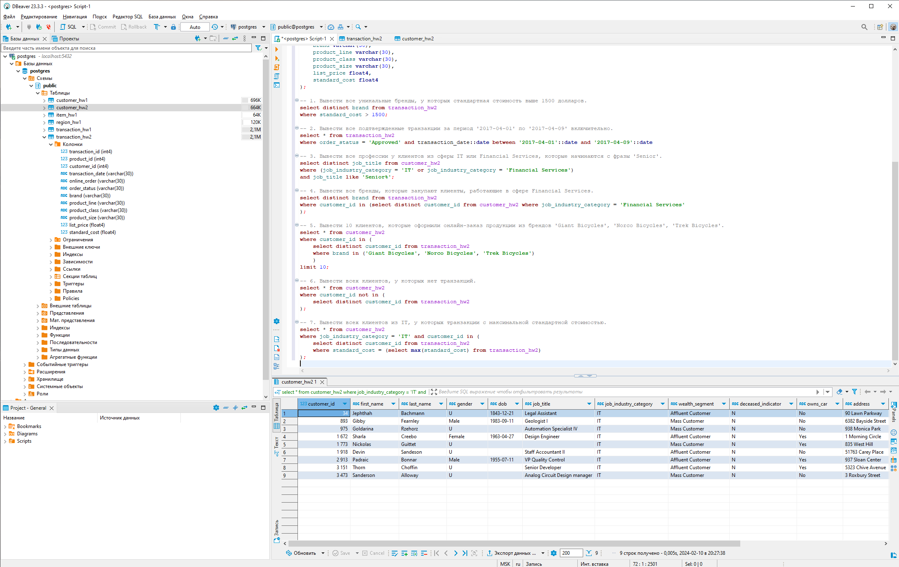
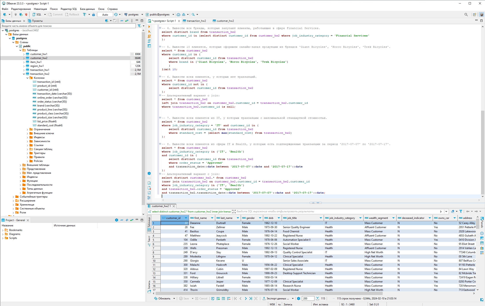

# HW2. Основные операторы PostgreSQL.
### Студент: Яськова Марина Андреевна
Отчетность по отдельности:
* [Файл с полным sql-скриптом](full_script.sql)
* [Папка со скриншотами](screenshots/)

Пошаговое решение со скриншотами представлено ниже.
## 1. Создание таблиц
```
create table customer_hw2 (
	customer_id int4,
	first_name varchar(50),
	last_name varchar(50),
	gender varchar(30),
	dob varchar(50),
	job_title varchar(50),
	job_industry_category varchar(50),
	wealth_segment varchar(50),
	deceased_indicator varchar(50),
	owns_car varchar(30),
	address varchar(50),
	postcode varchar(30),
	state varchar(30),
	country varchar(30),
	property_valuation int4
);

create table transaction_hw2 (
	transaction_id int4,
	product_id int4,
	customer_id int4,
	transaction_date varchar(30),
	online_order varchar(30),
	order_status varchar(30),
	brand varchar(30),
	product_line varchar(30),
	product_class varchar(30),
	product_size varchar(30),
	list_price float4,
	standard_cost float4
); 
```


## 2. Выполнение запросов
#### 1. Вывести все уникальные бренды, у которых стандартная стоимость выше 1500 долларов:
```
select distinct brand from transaction_hw2
where standard_cost > 1500;
```


#### 2. Вывести все подтвержденные транзакции за период '2017-04-01' по '2017-04-09' включительно:
```
select * from transaction_hw2
where order_status = 'Approved' and transaction_date::date between '2017-04-01'::date and '2017-04-09'::date
```


#### 3. Вывести все профессии у клиентов из сферы IT или Financial Services, которые начинаются с фразы 'Senior':
```
select distinct job_title from customer_hw2
where (job_industry_category = 'IT' or job_industry_category = 'Financial Services')
and job_title like 'Senior%';
```


#### 4. Вывести все бренды, которые закупают клиенты, работающие в сфере Financial Services:
```
select distinct brand from transaction_hw2
where customer_id in (select distinct customer_id from customer_hw2 where job_industry_category = 'Financial Services');
```


#### 5. Вывести 10 клиентов, которые оформили онлайн-заказ продукции из брендов 'Giant Bicycles', 'Norco Bicycles', 'Trek Bicycles':
```
select * from customer_hw2 
where customer_id in (
	select distinct customer_id from transaction_hw2 
	where brand in ('Giant Bicycles', 'Norco Bicycles', 'Trek Bicycles')
	) 
limit 10;
```


#### 6. Вывести всех клиентов, у которых нет транзакций:
```
select * from customer_hw2
where customer_id not in (
	select distinct customer_id from transaction_hw2
);
```
Альтернативный вариант с join:
```
select * from customer_hw2
left join transaction_hw2 on customer_hw2.customer_id = transaction_hw2.customer_id
where transaction_hw2.customer_id is null;
```


#### 7. Вывести всех клиентов из IT, у которых транзакции с максимальной стандартной стоимостью:
```
select * from customer_hw2
where job_industry_category = 'IT' and customer_id in (
	select distinct customer_id from transaction_hw2
	where standard_cost = (select max(standard_cost) from transaction_hw2)
);
```


#### 8. Вывести всех клиентов из сферы IT и Health, у которых есть подтвержденные транзакции за период '2017-07-07' по '2017-07-17':
```
select * from customer_hw2 
where job_industry_category in ('IT', 'Health')
and customer_id in (
	select distinct customer_id from transaction_hw2
	where order_status = 'Approved'
	and transaction_date::date between '2017-07-07'::date and '2017-07-17'::date
);
```
Альтернативный вариант с join:
```
select distinct customer_hw2.* from customer_hw2 
inner join transaction_hw2 on customer_hw2.customer_id = transaction_hw2.customer_id
where job_industry_category in ('IT', 'Health')
and transaction_hw2.order_status = 'Approved'
and transaction_hw2.transaction_date::date between '2017-07-07'::date and '2017-07-17'::date;
```

