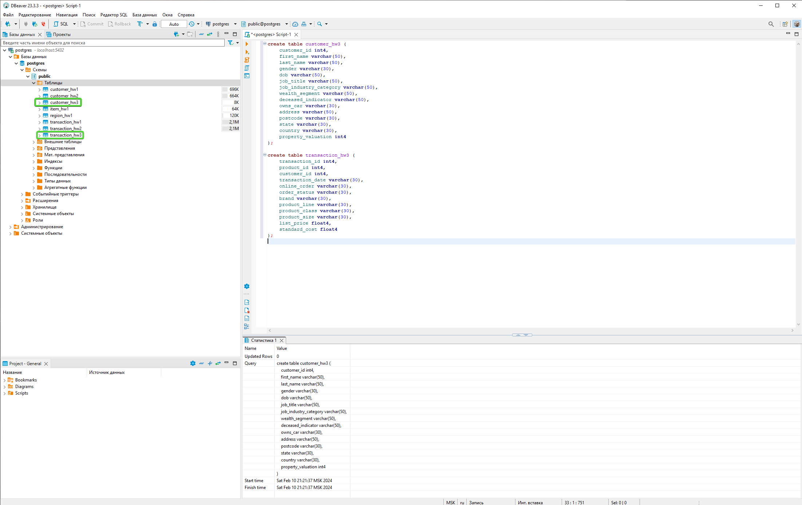
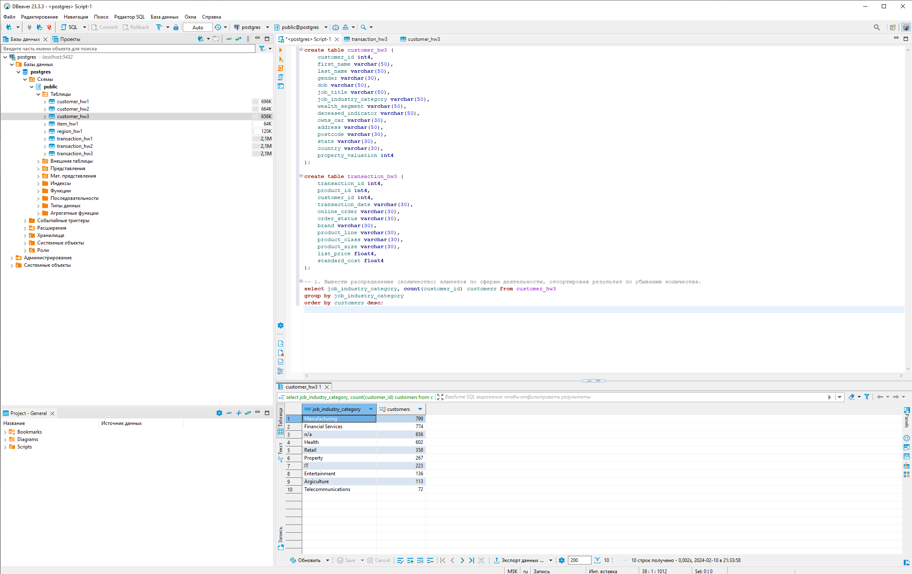
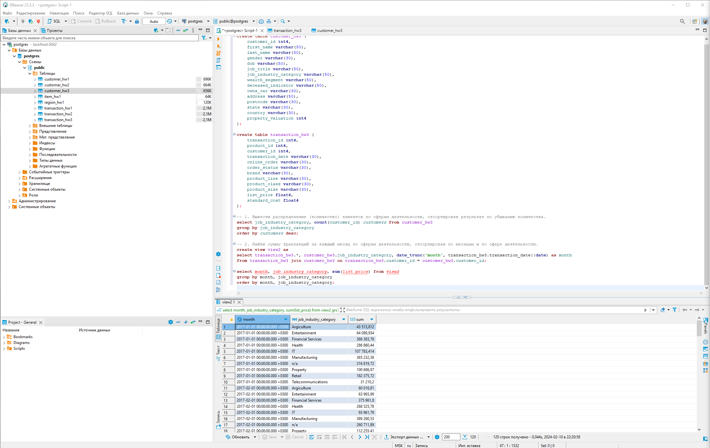
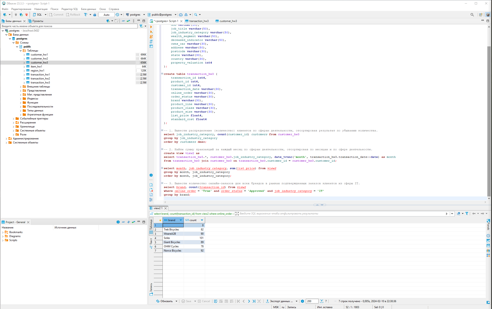
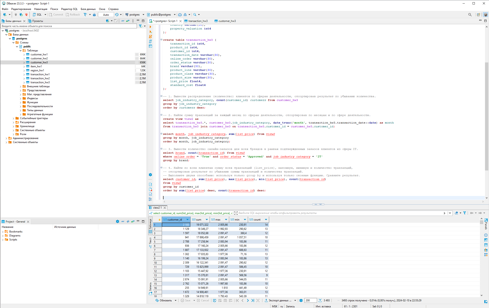
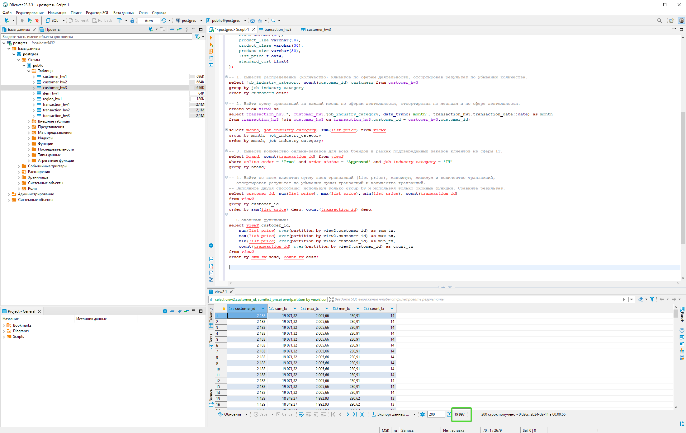
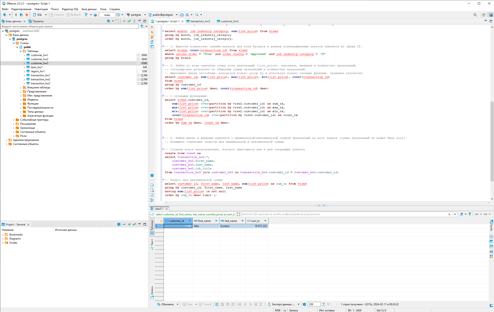
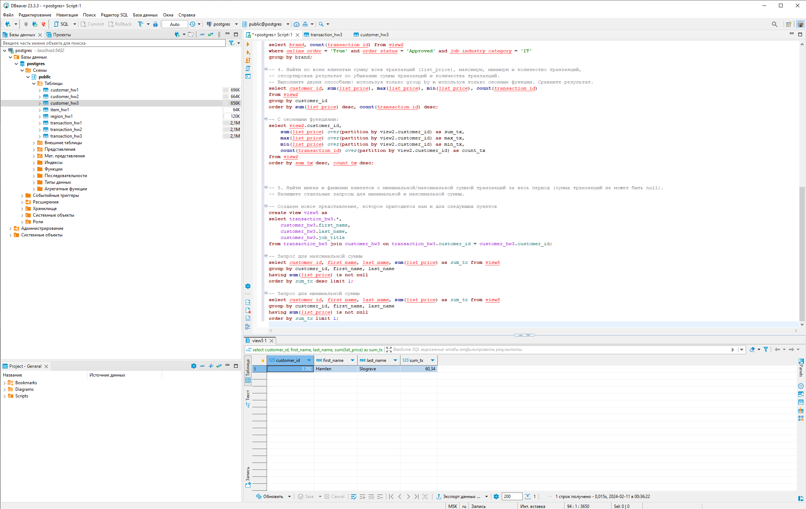
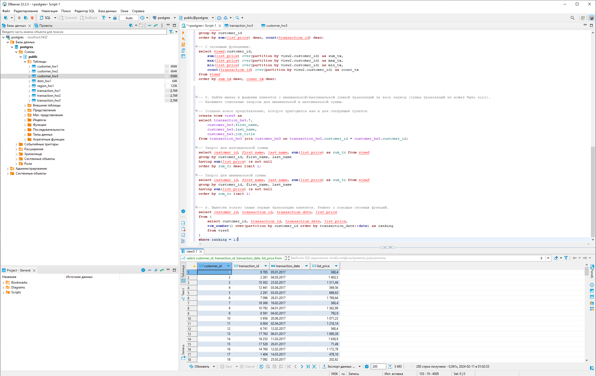
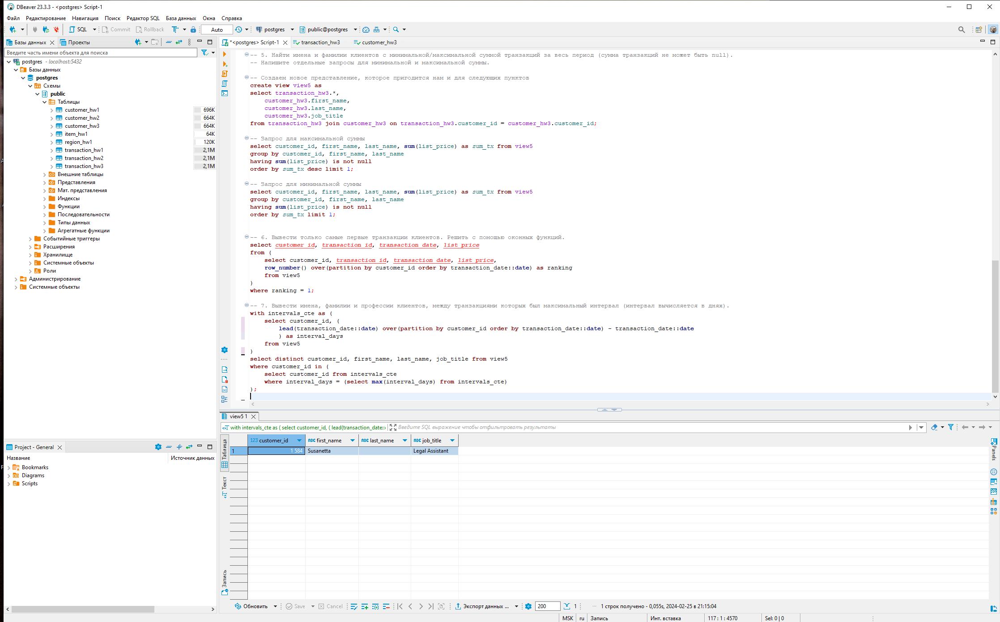

# HW2. Основные операторы PostgreSQL.
### Студент: Яськова Марина Андреевна
Пошаговое решение со скриншотами представлено ниже.
## 1. Создание таблиц
```
create table customer_hw3 (
	customer_id int4,
	first_name varchar(50),
	last_name varchar(50),
	gender varchar(30),
	dob varchar(50),
	job_title varchar(50),
	job_industry_category varchar(50),
	wealth_segment varchar(50),
	deceased_indicator varchar(50),
	owns_car varchar(30),
	address varchar(50),
	postcode varchar(30),
	state varchar(30),
	country varchar(30),
	property_valuation int4
);

create table transaction_hw3 (
	transaction_id int4,
	product_id int4,
	customer_id int4,
	transaction_date varchar(30),
	online_order varchar(30),
	order_status varchar(30),
	brand varchar(30),
	product_line varchar(30),
	product_class varchar(30),
	product_size varchar(30),
	list_price float4,
	standard_cost float4
); 
```

## 2. Выполнение запросов
#### 1. Вывести распределение (количество) клиентов по сферам деятельности, отсортировав результат по убыванию количества:
```
select job_industry_category, count(customer_id) customers from customer_hw3
group by job_industry_category 
order by customers desc;
```


#### 2. Найти сумму транзакций за каждый месяц по сферам деятельности, отсортировав по месяцам и по сфере деятельности:
Для этого пункта создаем представление view2.
```
create view view2 as
select transaction_hw3.*, customer_hw3.job_industry_category, date_trunc('month', transaction_hw3.transaction_date::date) as month
from transaction_hw3 join customer_hw3 on transaction_hw3.customer_id = customer_hw3.customer_id;

select month, job_industry_category, sum(list_price) from view2
group by month, job_industry_category
order by month, job_industry_category;
```


#### 3. Вывести количество онлайн-заказов для всех брендов в рамках подтвержденных заказов клиентов из сферы IT:
Продолжаем использовать представление из п.2.
```
select brand, count(transaction_id) from view2
where online_order = 'True' and order_status = 'Approved' and job_industry_category = 'IT'
group by brand;
```


#### 4. Найти по всем клиентам сумму всех транзакций (list_price), максимум, минимум и количество транзакций, отсортировав результат по убыванию суммы транзакций и количества транзакций. Выполните двумя способами: используя только group by и используя только оконные функции. Сравните результат:
Продолжаем использовать представление из п.2.

a. Вариант с group by. 3493 строки, customer_id уникальны:
```
select customer_id, sum(list_price), max(list_price), min(list_price), count(transaction_id)
from view2
group by customer_id
order by sum(list_price) desc, count(transaction_id) desc;
```

b. Вариант с оконными функциями. 19997 строк, customer_id дублируются по числу совершенных каждым клиентом транзакций:
```
select view2.customer_id,
	sum(list_price) over(partition by view2.customer_id) as sum_tx,
	max(list_price) over(partition by view2.customer_id) as max_tx, 
	min(list_price) over(partition by view2.customer_id) as min_tx, 
	count(transaction_id) over(partition by view2.customer_id) as count_tx
from view2
order by sum_tx desc, count_tx desc;
```


#### 5. Найти имена и фамилии клиентов с минимальной/максимальной суммой транзакций за весь период (сумма транзакций не может быть null). Напишите отдельные запросы для минимальной и максимальной суммы.
Создаем новое представление, которое пригодится нам и для следующих пунктов:
```
create view view5 as
select transaction_hw3.*,
	customer_hw3.first_name,
	customer_hw3.last_name,
	customer_hw3.job_title
from transaction_hw3 join customer_hw3 on transaction_hw3.customer_id = customer_hw3.customer_id;
```
a. Запрос для максимальной суммы:
```
select customer_id, first_name, last_name, sum(list_price) as sum_tx from view5
group by customer_id, first_name, last_name
having sum(list_price) is not null
order by sum_tx desc limit 1;
```

b. Запрос для минимальной суммы
```
select customer_id, first_name, last_name, sum(list_price) as sum_tx from view5
group by customer_id, first_name, last_name
having sum(list_price) is not null
order by sum_tx limit 1;
```


#### 6. Вывести только самые первые транзакции клиентов. Решить с помощью оконных функций:
```
select customer_id, transaction_id, transaction_date, list_price
from (
	select customer_id, transaction_id, transaction_date, list_price,
	row_number() over(partition by customer_id order by transaction_date::date) as ranking
	from view5
)
where ranking = 1;
```


#### 7. Вывести имена, фамилии и профессии клиентов, между транзакциями которых был максимальный интервал (интервал вычисляется в днях):
```
with intervals_cte as (
	select customer_id, (
		lead(transaction_date::date) over(partition by customer_id order by transaction_date::date) - transaction_date::date
		) as interval_days
	from view5
)
select distinct customer_id, first_name, last_name, job_title from view5
where customer_id in (
	select customer_id from intervals_cte 
	where interval_days = (select max(interval_days) from intervals_cte)
);
```
